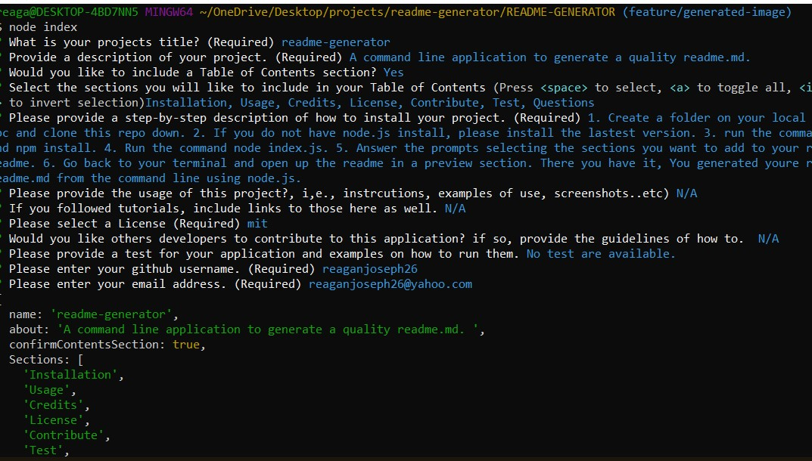

  # readme-generator 

  ## Description
  A command line application to generate a high quality readme.

  ## Table of Contents
  * [Installation](#installation)
  * [Usage](#usage)
  * [Credits](#credits)
  * [License](#license)
  * [Contributing](#Contributing)
  * [Test](#test)
  * [Questions](#questions)
  

  ## Installation
  1. Create a folder on your local pc and clone this repo down. 
  2. If you do not have node.js install, please install the lastest version. 
  3. run the command npm install. 
  4. Run the command node index.js. 
  5. Answer the prompts selecting the sections you want to add to your readme. 
  6. Go back to your terminal and open up the readme in a preview section. There you have it, You generated youre readme.md from the command line using node.js.

  ## Usage
  Usage in your READme.md would include examples for use any screen shots. To include a screenshot in your READme you would follow the syntax of: 
   
  This is a ideally what your terminal should look like when ran successfully. 
  

  ## Credits
  List of collbaorators, third party assets, and/or any tutorials you followed.  
  Currently no credits are applicable for this project. 

  ## License
  Licenses let other developers know what they can and cannot do with your project. 
  For exmaple: This licence is covered undered (https://opensource.org/licenses/MIT).
  This project, Readme-generator, currently does not have a license. The MIT badge showing up at the top is also an example of adding a badge to your readme.
  

  ## Contributing 
  N/A

  ## Test
  A test sections provides tests for your application with instrcutions on how to run them.
  Currently no test are available for this project. 

  ## Questions
  If you have any additional questions, please reach out to me. 
  You can reachout to me at my GitHub profile, which is [reaganjoseph26](https://github.com/reaganjoseph26).
  Also, you can reach out to me by email. My email address is reaganjoseph26@yahoo.com. 
  